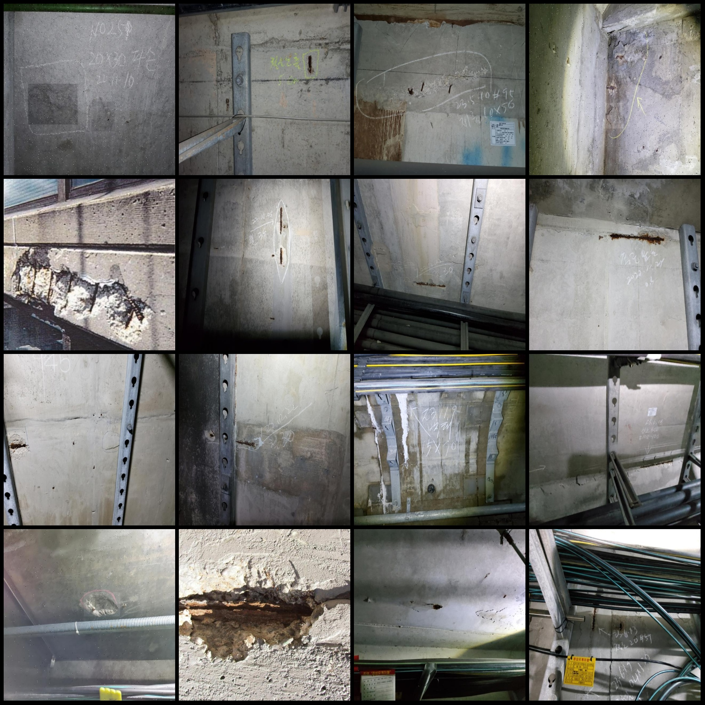
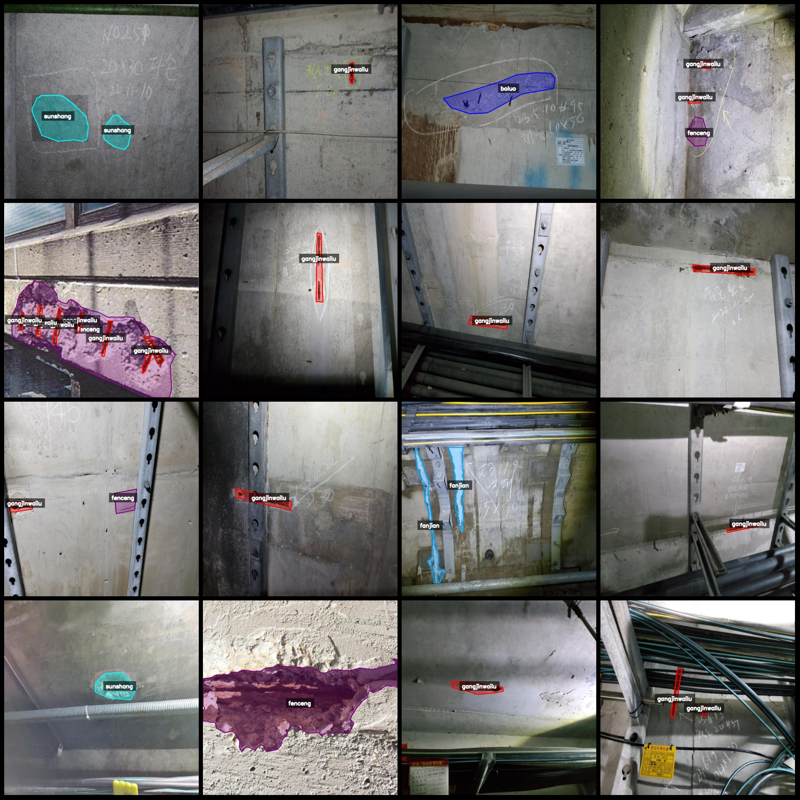
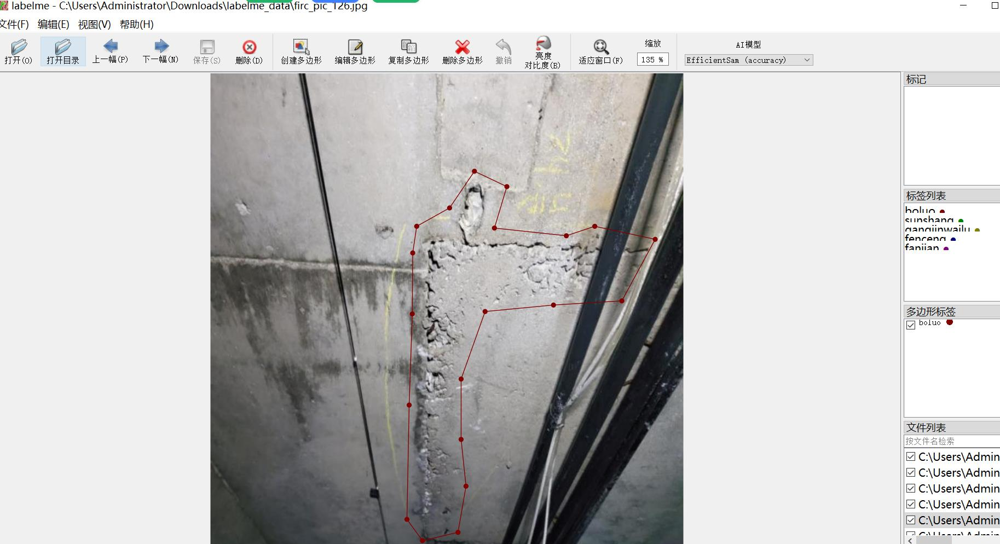

# Tunnel Decay, Scale Layering, Rebar Exposure, Crack Defect Identification and Segmentation Data Set - LabelMe Format: 1412 Images, 6 Categories

Dataset format: LabelMe (excluding mask files, only containing JPG images and corresponding JSON files)
Number of images (JPG file count): 1412
Number of annotations (JSON file count): 1412
Number of annotation categories: 6
Annotation category names: ["boluo", "fanjian", "fenceng", "gangjinwailu", "liefeng", "sunshang"]
Corresponding Chinese category names: ["decay", "scale layering", "rebar exposure", "crack", "damage"]
Box counts for each category:
boluo count = 238
fanjian count = 420
fenceng count = 483
gangjinwailu count = 1520
liefeng count = 143
sunshang count = 323
Total box count: 3127

Annotation tools used: LabelMe version 5.5.0
Image resolution: 640x640
Annotation rules: Polygon is drawn around the category
Important note: The dataset can be edited in LabelMe, but the JSON dataset needs to be converted into mask or Yolo/COCO format for semantic segmentation or instance segmentation.
Special declaration: This dataset does not guarantee the accuracy of the trained model or weight files.

Image preview:
Annotation examples:
Randomly selected 16 images for illustration:
Annotated drawing results:
LabelMe editing example image:

## Image

Here is a pay link on Stripe ( https://buy.stripe.com/3cs8yP7sY87d0vu9AB ). Please contact me lonlonago@foxmail.com after funding $89, and I will send you a complete data files , thank you!

